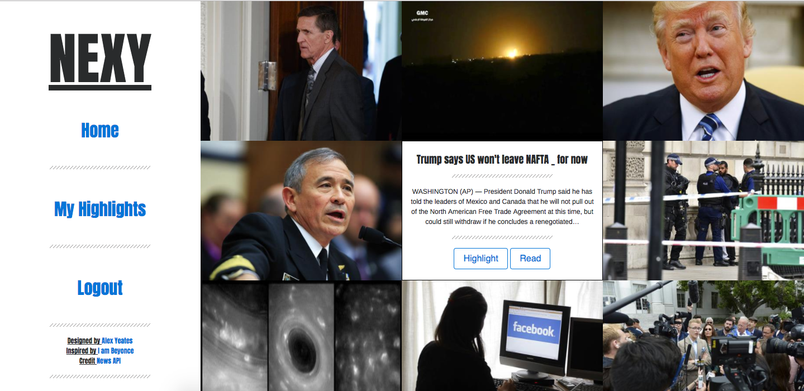

<h1>WDI-Project-2 - NEXY</h1>

</img>

<h2>Introduction</h2>

This is my <strong>second project</strong> for the <strong>Web Development Immersive</strong> course at <strong>General Assembly</strong> in London. <strong>NEXY</strong> is a simple news aggregator which allows logged in users to <em>highlight</em> their favourite stories.




You can see a <strong>working version</strong> of the game <a href="#">here</a>.

You can see the <strong>code</strong> for NEXY <a href="#>here</a>.


<h3>How NEXY Works</h3>

NEXY uses the News API to pull in data from a number of news sources. A function then loops through the data to find the relevant information to fit the a 'highlight' model. 

```function newsApi(source) {
  $
  .get(`https://newsapi.org/v1/articles?source=${source}&sortBy=top&apiKey=e791d42519134d8ca50ff49ea0b3d33a`)
  .done(data => {
    var articleArray = data.articles;
    articleArray.forEach(function(element) {
      $(`<div class="grid-item">
      
        <div class="hover">
          <br >
          <h2>${element.title}</h2>
          <hr >
          <p>${element.description}</p>
          <hr >
          <button class="highlight btn btn-outline-primary">Highlight</button>
          <button class="btn btn-outline-primary"><a href="${element.url}">Read</a></button>
        </div>
      </div>`)
      .appendTo('#news');
    });
  });
}```


<h2>Project Brief</h2>


<h2>How It Was Built</h2>


<h2>Future Improvements</h2>


<h2>Credits</h2>


- GA Instructors Alex Chin and Rane Gowan.
- GA Teaching Assistants Nat Huitson and Ed Compton. 